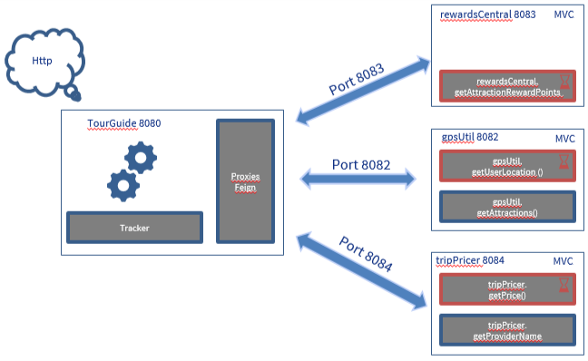

# RewardCentral
API REST micro-service for TourGuide application to managing travel and attraction for a custumer.
TripPricer manage trip price informations. 
This app use SPRINT BOOT, FeignClient.

## Getting Started

- Endpoint : http://localhost:8084/

## Prerequisites

- Java 1.8  or later
- Spring Boot 2.2.6
- Gradle 2.2.5

# Installation

No Database creation needed:

To start the application start sub-micro-service with or without docker in build libs directories: 
- TripPricer : java -jar tripPricer-0.0.1-SNAPSHOT.jar

# Architecture Diagram

# URI
## Get Price
Example : 
http://localhost:8084/getPrice?apiKey=abc&attractionId=123e4567-e89b-12d3-a456-426614174000&adults=2&children=2&nightsStay=5&rewardsPoints=10

## get Provider Name
Example : 
http://localhost:8083/getProviderName?apiKey=abc&adults=2